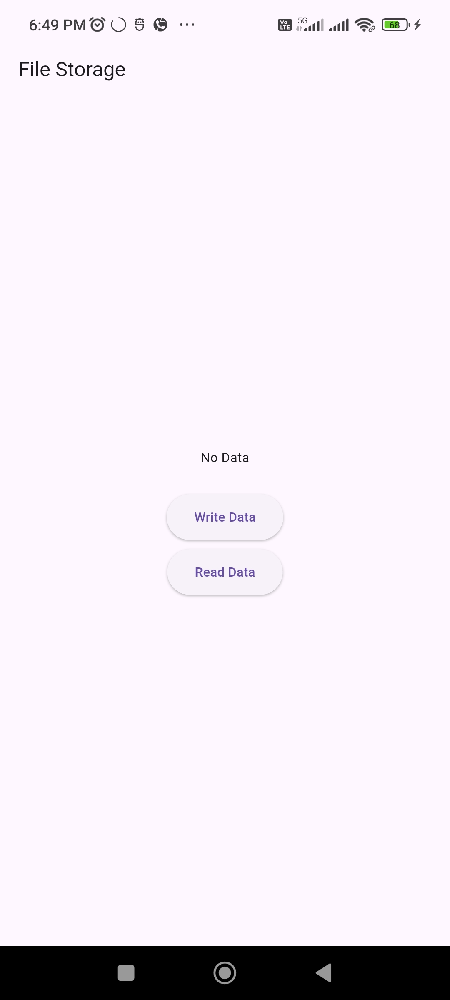
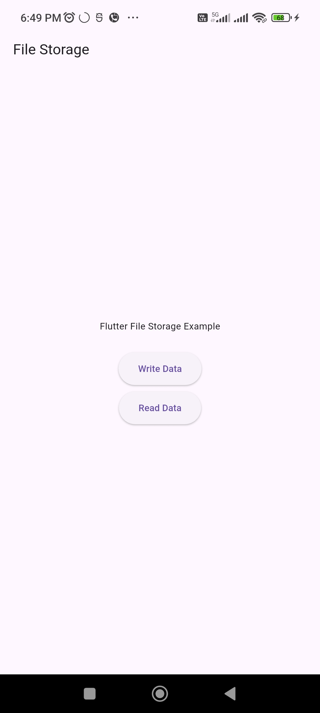

# Experiment 8: File Storage Application

## Student Information
* **Name:** Ayush  
* **Roll Number:** 23EACAD025  
* **Batch:** Alpha-1  
* **Section:** G-1  
* **Department:** Artificial Intelligence & Data Science  
* **Course:** B.Tech – AI & Data Science  

---

## Aim
To store and retrieve data locally in device storage using Flutter.

---

## Procedure
1. Added `path_provider` dependency in `pubspec.yaml`.  
2. Imported `dart:io` and `path_provider` packages.  
3. Created a `StatefulWidget` to manage file operations.  
4. Implemented functions to:  
   - Get file path using `getApplicationDocumentsDirectory()`.  
   - Write data to a file using `File.writeAsString()`.  
   - Read data from a file using `File.readAsString()`.  
5. Updated UI dynamically with `setState()` to show file contents.  
6. Added buttons for **Write Data** and **Read Data** operations.  

---

## Output
The application successfully writes data to local storage and retrieves it when requested.
- **Initial State + Write File**
 

- **Reading File**
  

---

## Conclusion
This experiment demonstrated how to use **path_provider** and **File class** for local storage in Flutter, enabling offline persistence of data.

---

## How to Run
1. Create a new Flutter project:  
   ```bash
   flutter create experiment_8
   cd experiment_8
